# Procesverslag
Markdown is een simpele manier om HTML te schrijven.  
Markdown cheat cheet: [Hulp bij het schrijven van Markdown](https://github.com/adam-p/markdown-here/wiki/Markdown-Cheatsheet).

Nb. De standaardstructuur en de spartaanse opmaak van de README.md zijn helemaal prima. Het gaat om de inhoud van je procesverslag. Besteedt de tijd voor pracht en praal aan je website.

Nb. Door *open* toe te voegen aan een *details* element kun je deze standaard open zetten. Fijn om dat steeds voor de relevante stuk(ken) te doen.

## Jij

  
uitwerken voor kick-off werkgroep

  ### Auteur:
  Casper Kroon

  #### Je startniveau:
  Blauw

  #### Je focus:
  Responsive
 

## Je website

  
uitwerken voor kick-off werkgroep

  ### Je opdracht:
  https://www.creedfragrance.com

  #### Screenshot(s) van de eerste pagina (small screen): 
  Creed homepagina
  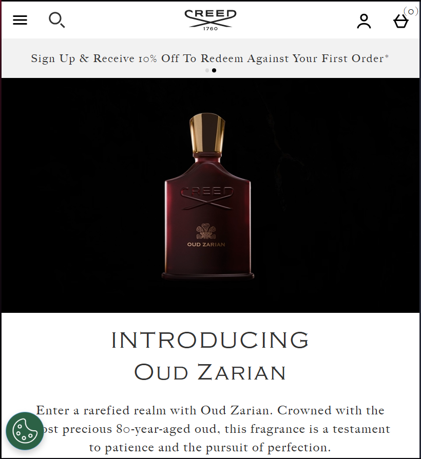
  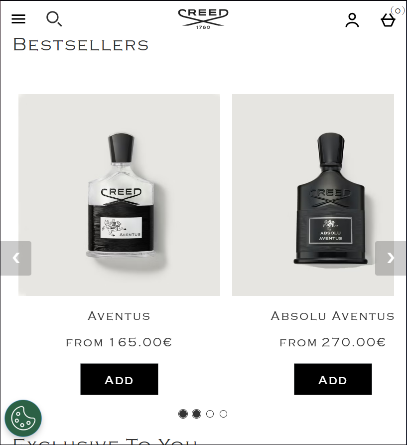
  

  #### Screenshot(s) van de tweede pagina (small screen):
  Creed Aventus subpagina  
  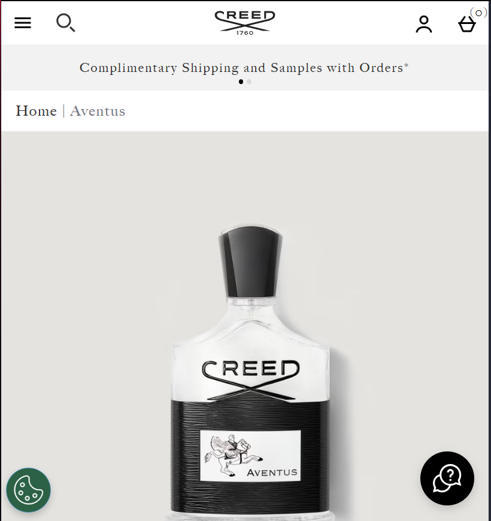
  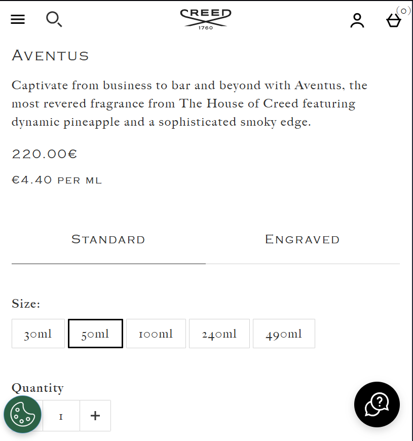
  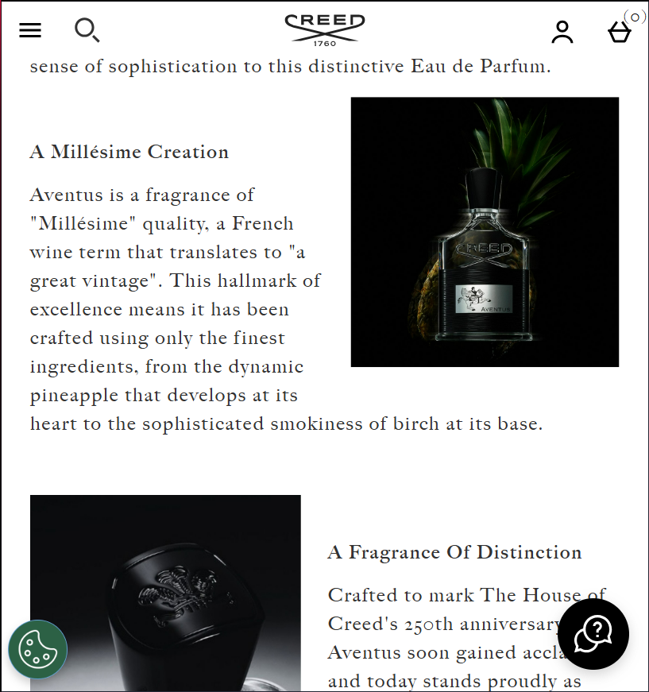
 

## Toegankelijkheidstest 1/2 (week 1)

  
uitwerken na test in 2e werkgroep

  ### Bevindingen
  Screenreader:
  - Gebrek aan H1, zorgt voor verwarring tijdens het skippen tussen kopjes.
  - Werkt maar onduidelijk.
  - Lijkt geen mogelijk te hebben om terug te skippen

  Lijst met je bevindingen die in de test naar voren kwamen:
  - Geen echte H1
  - Veel fouten in HTML, veel onnodige / in tags, verder issues waar ik niet veel van begreep.
  - Alleen gebruik van UL
  - Decoratieve images gebruiken geen null alt
  - Video autoplayt, heeft controls.
  - Geen dark en light of high contrast mode.

## Breakdownschets (week 1)

  
uitwerken na afloop 3e werkgroep

  ### de hele pagina: 
  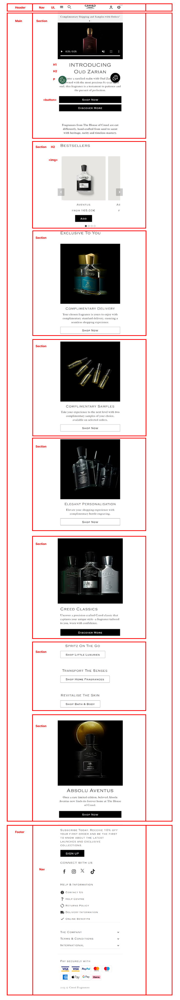

  ### dynamisch deel (bijv menu): 
  

  ### wellicht nog een dynamisch deel (bijv filter): 
  

## Voortgang 1 (week 2)

  
uitwerken voor 1e voortgang

  ### Stand van zaken
  hier dit ging goed & dit was lastig (neem ook screenshots op van delen van je website en code)

  - html schrijven was prima te doen

  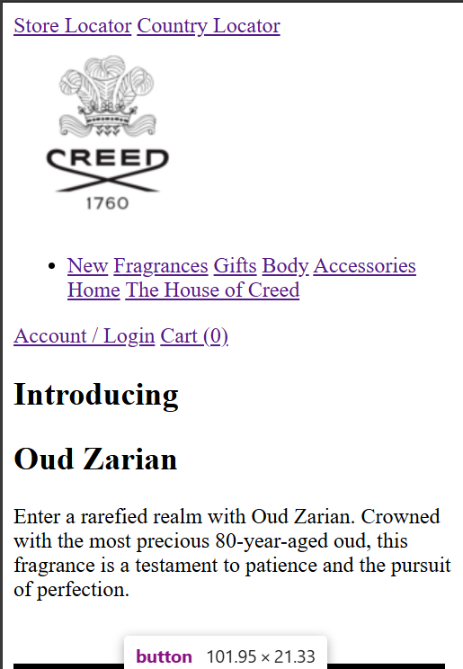
  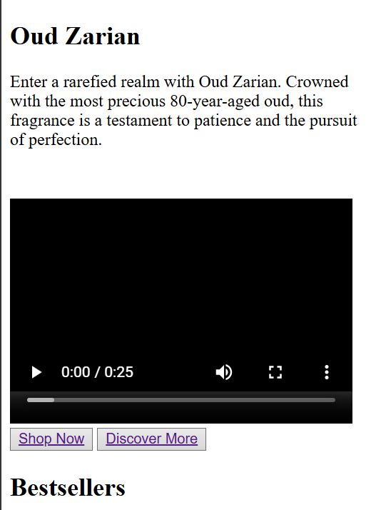
  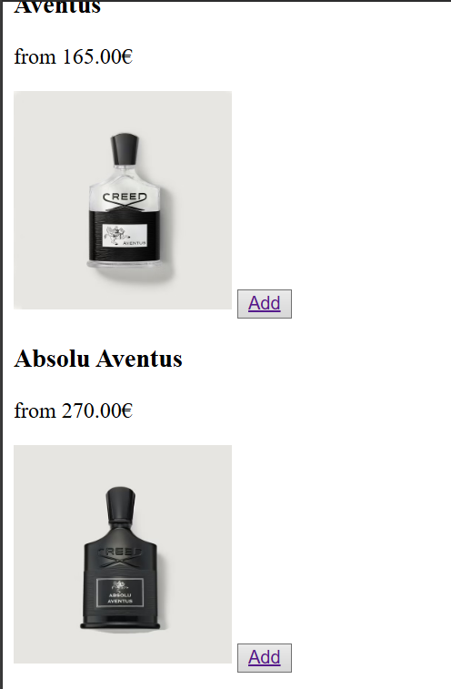
  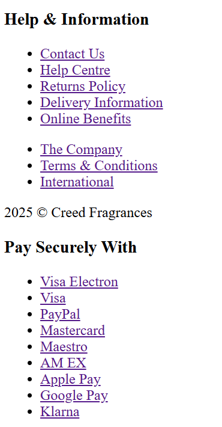

  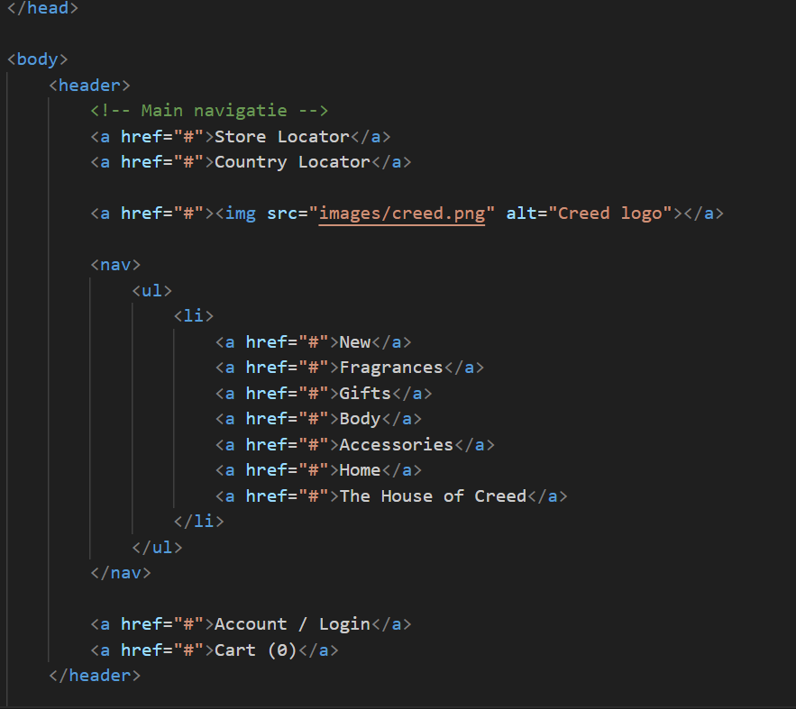
  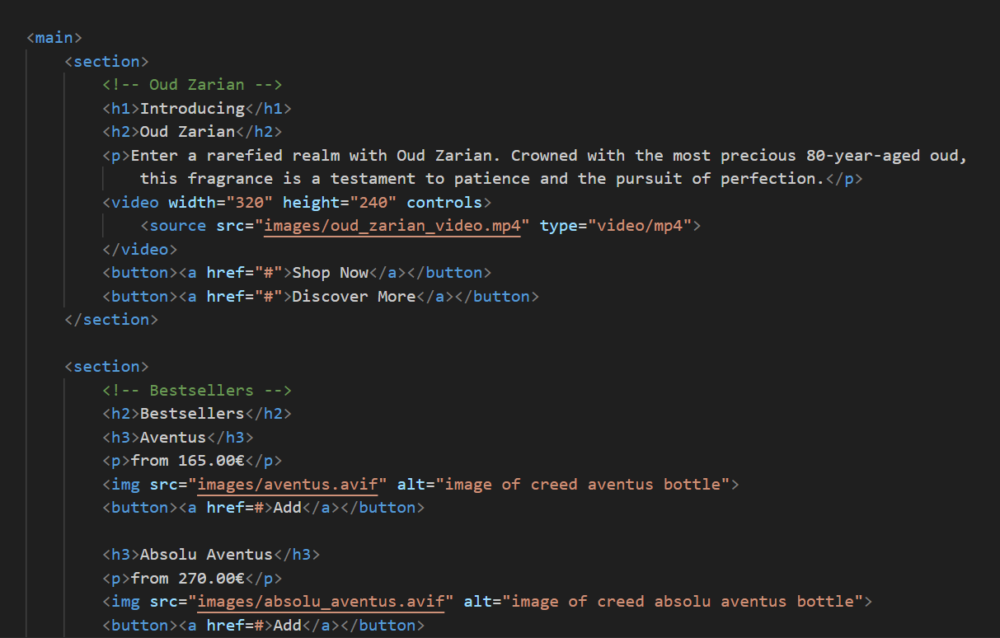
  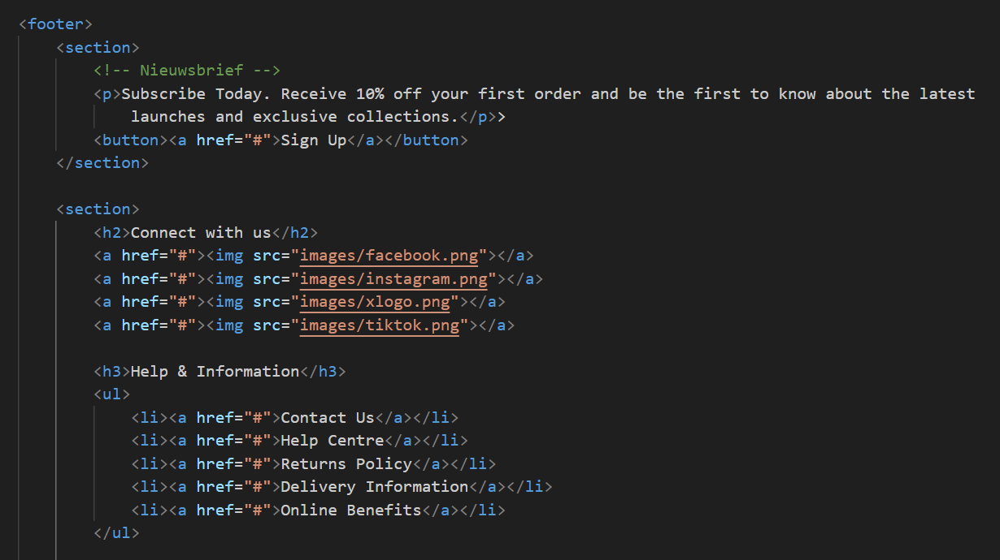

  ### Agenda voor meeting
  samen met je groepje opstellen

  | Yaël           | Joep               | Casper       | student 4        |
  | ---            | ---                | ---          | ---              |
  | Hamburgermenu  | Fontface/family    | Zoekbalk     | dit wil ik zeker |
  | ...            | ...                | ...          | ...              |

  ### Verslag van meeting
  hier na afloop snel de uitkomsten van de meeting vastleggen

  - punt 1
  - punt 2
  - nog een punt
  - ...

  - 3 stylesheets, 1 algemene, 1 per pagina zelf
  - nav 1 diep
  - https://developer.mozilla.org/en-US/docs/Web/HTML/Reference/Elements/search
    Actions weghalen

## Voortgang 2 (week 3)

  
uitwerken voor 2e voortgang

  ### Stand van zaken
  Basis CSS van de website ging goed, laatste uitwerking van main HTML ook gelukt. Wat lastig ging
  was de navbar. Er waren een aantal problemen die ervoor zorgde dat deze niet werkte zoals bedoeld.

  ### Agenda voor meeting
  samen met je groepje opstellen

  | Casper         | Joep               | Yael         | student 4        |
  | ---            | ---                | ---          | ---              |
  | issues navbar  | Navbar             | navbar       | dit wil ik zeker |
  | ...            | ...                | ...          | ...              |

  ### Verslag van meeting
  hier na afloop snel de uitkomsten van de meeting vastleggen

  - Grid gebruiken voor de navbar ipv flexbox
  - 
- ...

## Toegankelijkheidstest 2/2 (week 4)

  
uitwerken na test in 9e werkgroep

  ### Bevindingen
  Lijst met je bevindingen die in de test naar voren kwamen (geef ook aan wat er verbeterd is):

  -Alles is berijkbaar met screenreader, logische volgorde deze keer. Alles duidelijk opgenoemd.
  -H1 is aanwezig, maar onzichtbaar.

## Voortgang 3 (week 4)

  
uitwerken voor 3e voortgang

  ### Stand van zaken
  hier dit ging goed & dit was lastig (neem ook screenshots op van delen van je website en code)

  ### Agenda voor meeting
  samen met je groepje opstellen

  | Casper         | Yael               | Joep         | Abdenour         |
  | ---            | ---                | ---          | ---              |
  | Responsiveness | grid               | afbeeldingen   |                |
  | Navbar en carousel|                 | juist scalen |                  |
  | ...            | ...                | ...          | ...              |

  ### Verslag van meeting
  hier na afloop snel de uitkomsten van de meeting vastleggen

  - flexbox gebruiken ipv grid voor navbar.
  - juiste positions gebruiken, kijken via inspect element wat de oorzaak is
  - nog een punt
  - ...

## Eindgesprek (week 5)

  
uitwerken voor eindgesprek

  ### Je uitkomst - karakteristiek screenshots:
  

  ### Dit ging goed/Heb ik geleerd: 
  Korte omschrijving met plaatjes

  

  ### Dit was lastig/Is niet gelukt:
  Korte omschrijving met plaatjes

  

## Bronnenlijst

  
continu bijhouden terwijl je werkt

  Nb. Wees specifiek ('css-tricks' als bron is bijv. niet specifiek genoeg). 
  Nb. ChatGpT en andere AI horen er ook bij.
  Nb. Vermeld de bronnen ook in je code.

  1. [bron 1](https://codepen.io/shooft/pen/yLKjzWa) voor carousel
  2. https://www.creedfragrance.com afbeeldingen en fonts
  3. Chatgpt voor het responsive maken van de carousel. Prompt = code gepaste + how to make it so the carousel
  allows for 2 and 3 images next to eachother when the page gets big enough.

